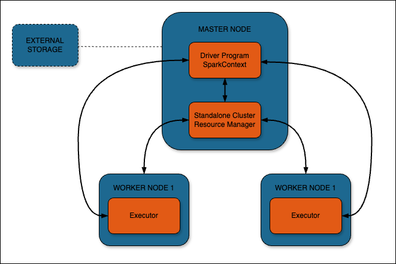

# Apache Spark One-Click Cluster


Apache Spark is a powerful open-source unified analytics engine for large-scale data processing. It provides high-level APIs in Java, Scala, Python, and R, and an optimized engine that supports general execution graphs. Spark is designed for both batch and streaming data processing, and it's significantly faster than traditional big data processing frameworks.

This cluster is deployed with Apache Spark in standalone cluster mode, consisting of a Master node and two Worker nodes. The standalone cluster manager is a simple way to run Spark in a distributed environment, providing easy setup and management for Spark applications.

Scala, a multi-paradigm programming language, is integral to Apache Spark. It combines object-oriented and functional programming in a concise, high-level language that runs on the Java Virtual Machine (JVM). Spark itself is written in Scala, and while Spark supports multiple languages, Scala provides the most natural and performant interface to Spark's APIs.

The minimum RAM requirement for the worker nodes is 4GB RAM to ensure that jobs can run on the workers without encountering memory constraints. This configuration allows for efficient processing of moderately sized datasets and complex analytics tasks.

NGINX is installed on the master node as a reverse proxy to the worker nodes. The user interface URL is the domain (or rDNS value if no domain was entered). The workers are available via this reverse proxy setup. To access the UI on the master, you will need to provide the username and password that were specified during the cluster deployment. These credentials are also available at `/home/$USER/.credentials` for reference.

A Let's Encrypt Certificate is installed in the NGINX configuration. Using NGINX as a revewrse proxy allows for both authentication to the front-end UI, and simplicity when it comes to renewing the Let's Encrypt certificates for HTTPS.

## Distributions

- Ubuntu 22.04 LTS

## Software Included

| Software  | Version   | Description   |
| :---      | :----     | :---          |
| Apache Spark | 3.4 | Unified analytics engine for large-scale data processing |
| Java OpenJDK | 11.0 | Runtime environment for Spark |
| Scala | 2.11 | Programming language that Spark is built with, providing a powerful interface to Spark's APIs |
| NGINX | 1.18 | High-performance HTTP server and reverse proxy |
| UFW | | Uncomplicated Firewall for managing firewall rules |
| Fail2ban | | Intrusion prevention software framework for protection against brute-force attacks |

## Use our API

Customers can choose to the deploy the Apache Spark app through the Linode Marketplace or directly using API. Before using the commands below, you will need to create an API token or configure linode-cli on an environment.

Make sure that the following values are updated at the top of the code block before running the commands:

SHELL:
```
# user defined
export TOKEN="your api token"
export ROOT_PASS="aComplexP@ssword"
export SUDO_USERNAME="admin"
export CLUSTER_NAME="name of your cluster"
export LABEL="cluster label"
export SPARK_USER="spark username"
export REGION="datacenter region"

curl -H "Content-Type: application/json" \
-H "Authorization: Bearer $TOKEN" \
-X POST -d '{
    "authorized_users": [
        "yourUser"
    ],
    "backups_enabled": false,
    "booted": true,
    "image": "linode/ubuntu22.04",
    "label": "apache-spark-cluster",
    "private_ip": false,
    "region": "${REGION}",
    "root_pass": "${ROOT_PASS}",
    "stackscript_data": {
        "add_ssh_keys": "yes",
        "cluster_size": "3",
        "token_password": "${TOKEN}",
        "cluster_name": "${CLUSTER_NAME}",
        "sudo_username": "${SUDO_USERNAME}",
        "soa_email_address": "${SOA_EMAIL_ADDRESS}",
        "spark_user": "${SPARK_USER}"
    },
    "stackscript_id": 1403818,
    "tags": [
        "yourtag"
    ],
    "type": "g6-standard-2"
}' https://api.linode.com/v4/linode/instances

```

CLI:
```
linode-cli linodes create \
  --authorized_users yourUser \
  --backups_enabled false \
  --booted true \
  --image 'linode/ubuntu22.04' \
  --label ${LABEL} \
  --private_ip true \
  --region ${REGION} \
  --root_pass '${ROOT_PASS}' \
  --stackscript_data '{"add_ssh_keys": "yes","cluster_size":"3","token_password":"${TOKEN_PASSWORD}","cluster_name":"${CLUSTER_NAME}","sudo_username":"${SUDO_USERNAME}","soa_email_address":"${SOA_EMAIL_ADDRESS}", "domain":"${DOMAIN}"}' \
  --stackscript_id 1403818 \
  --tags mytag \
  --type g6-standard-2

```

## Resources
- [Create Linode via API](https://www.linode.com/docs/api/linode-instances/#linode-create)
- [Stackscript referece](https://www.linode.com/docs/guides/writing-scripts-for-use-with-linode-stackscripts-a-tutorial/#user-defined-fields-udfs)